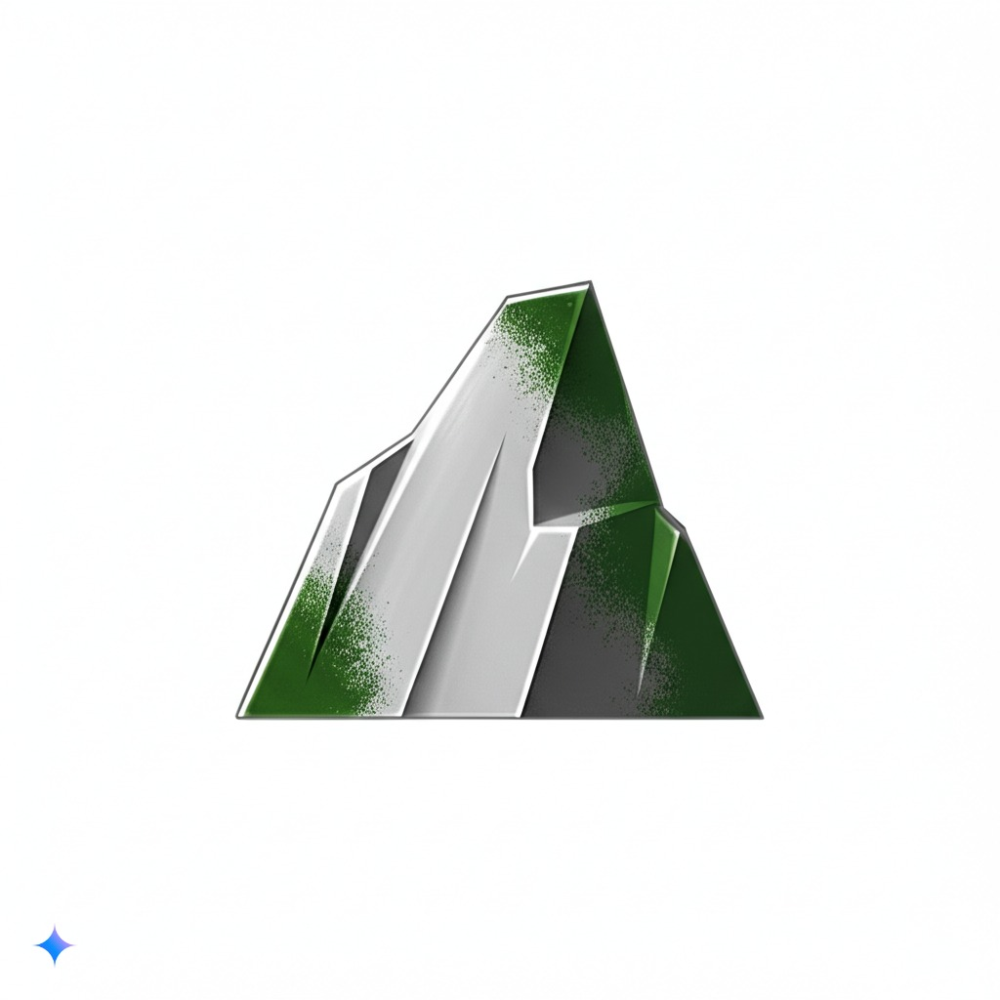
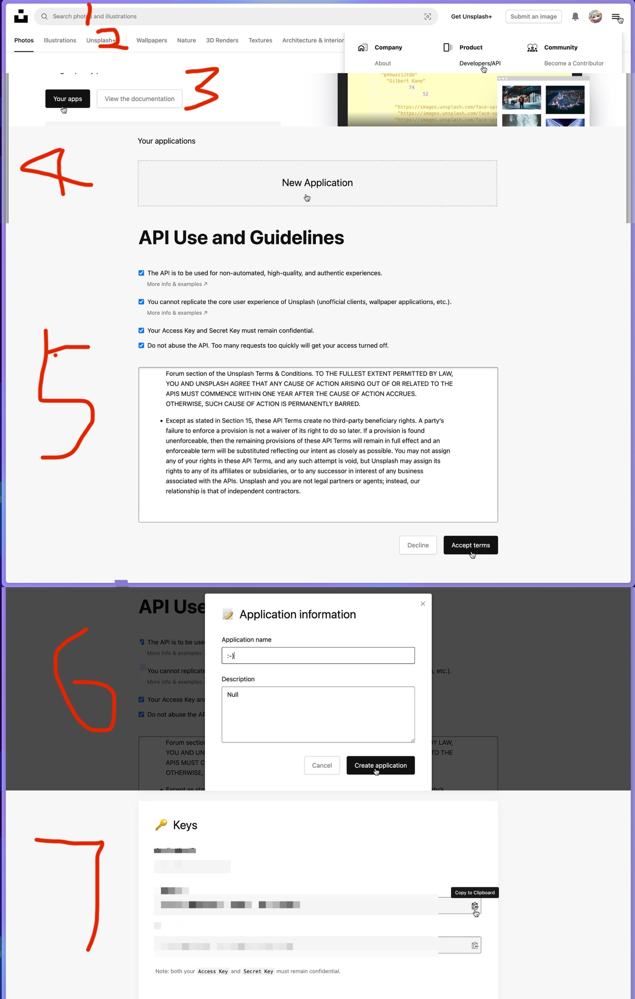

# VestigeX
<div style="display: flex; justify-content: center; align-items: center;">
  
  An AI Powered but Light Browser Home Page ⚡️
</div>

## <p xmlns:cc="http://creativecommons.org/ns#" >This work is licensed under <a href="https://creativecommons.org/licenses/by-nc-sa/4.0/?ref=chooser-v1" target="_blank" rel="license noopener noreferrer" style="display:inline-block;">CC BY-NC-SA 4.0</a></p>

## How To Use it?  
1. You Need To Install NodeJS & NPM in Your Computer
2. ```cd /path/to/this/dist/route```
3. ```npx serve```
4. **Enjoy The VestigeX V_0.2.1-alpha.1**

## Q & A
### 1. How To Use unSplash Background Pictures?  
你需要拥有unsplash API：
首先打开unsplash官网: [unsplash官网](https://unsplash.com/?flash=loggedOut)  

接着跟着图片来👇：


<h3>复制好以后这样做：</h3>  

1. 确保你在工程(非dist)目录下：
```shell
 pwd
 ##理应返回：
 /Your/PC/Router/VestigeX

```
2. 进入 **/VestigeX/src/scripts/unSplash/getUnSplashImg.js**
3. 将这段中的**YOUR_API_KEYS**换成你刚复制的Access Key
```js
?client_id=YOUR_API_KEYS=pc_wallpapers
```
4. 接着准备工程环境：
```shell
npm install

## 理应返回：

added XXX packages, and audited XXX packages in Xs

X packages are looking for funding
  run `npm fund` for details

X moderate severity vulnerabilities

To address all issues (including breaking changes), run:
  npm audit fix --force

Run `npm audit` for details. 
```
5. 启动工程环境：
```shell
    npm run dev
```
6. **Enjoy😃！**


### 2. How To Use Google Gemini AI?
你需要拥有Gemini API KEY
首先登陆Google AI Studio KEY官网: [Google AI Studio KEY官网](https://aistudio.google.com/apikey?hl=zh-cn)  

后面流程和unsplash大致相同

### 3 & N:为什么这么简陋，为什么功能残缺，为什么很多还烂尾，为什么没适配移动端？
Because，但凡你看到alpha就知道为什么了……
